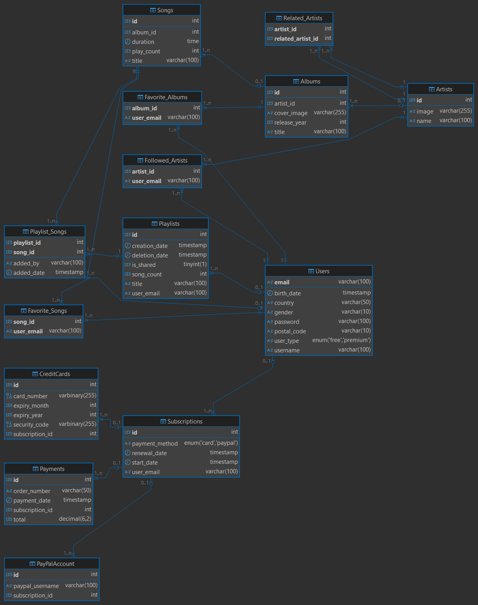

# 🎵 Spotify Database Project

## 📄 Description – Exercise Statement

This exercise involves designing and implementing a simplified database model for a music streaming platform inspired by Spotify. The goal is to identify the core entities and their relationships, create normalized tables, enforce referential integrity, and simulate real-world behavior such as user subscriptions, payments, playlists, songs, albums, and artist relations.

The schema supports different user types (free and premium), payment methods (credit card or PayPal), playlist sharing, soft-deletion of playlists, tracking favorites, and following artists.

## 💻 Technologies Used

- **MySQL 8.0+**
- **SQL** (DDL and DML)
- **AES_ENCRYPT/AES_DECRYPT** (MySQL built-in encryption functions)
- **ER modeling concepts**
- SQL-compatible development tools (e.g., MySQL Workbench, DBeaver, phpMyAdmin)



## 📋 Requirements

- MySQL server (version 8.0 or higher)
- MySQL client or interface (Workbench, DBeaver, or terminal)
- Access to a MySQL user with privileges to create databases and tables
- Optional: ER diagram tool (Lucidchart, dbdiagram.io, etc.)

## 🛠️ Installation

1. Clone or download the project repository.
2. Open your MySQL client and connect to your database server.
3. Create a new database (optional):
   ```sql
   CREATE DATABASE spotify_db;
   USE spotify_db;
   ```
4. Import the SQL script:
   - If using MySQL CLI:
     ```bash
     mysql -u your_user -p spotify_db < spotify_model_and_data.sql
     ```
   - Or copy-paste the content of `spotify_model_and_data.sql` into your SQL editor and execute it.

## ▶️ Execution

After importing the script:
- All tables and sample data will be available.
- You can run SELECT queries to test the relationships and integrity of the data.
- Examples:
  ```sql
  SELECT * FROM Users;
  SELECT * FROM Playlists WHERE is_shared = TRUE;
  SELECT * FROM Payments WHERE subscription_id = 1;
  ```

## 🌐 Deployment

This project is intended for educational and local development use only. For production deployment:
- Do **not store** real credit card data in plain text (use tokenization or external services).
- Store encryption keys securely outside the database.
- Implement access control and authentication in the application layer.
- Optionally migrate the schema to a cloud-based SQL service (e.g., AWS RDS, Google Cloud SQL).
